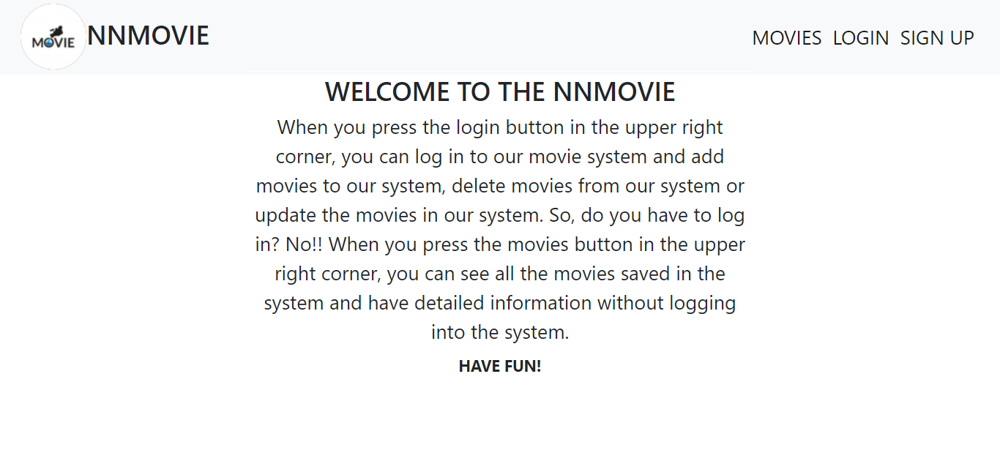
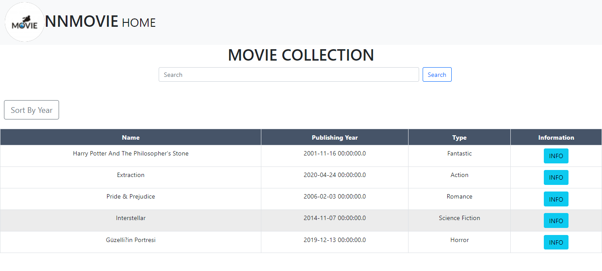
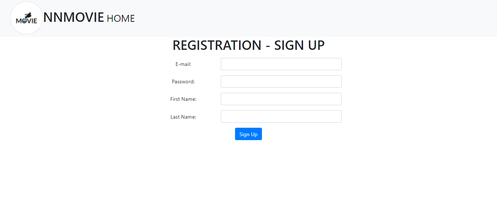
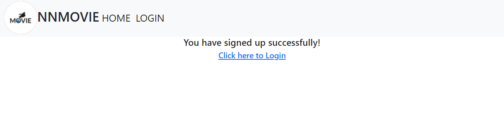
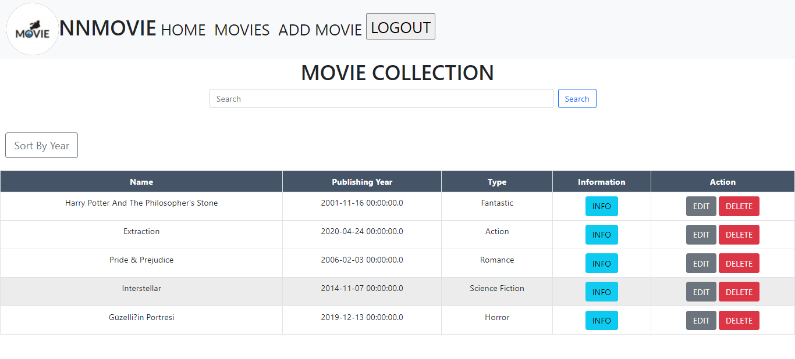
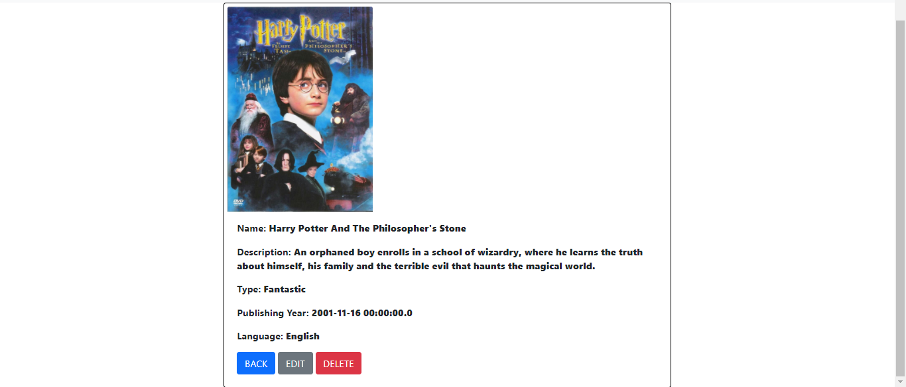
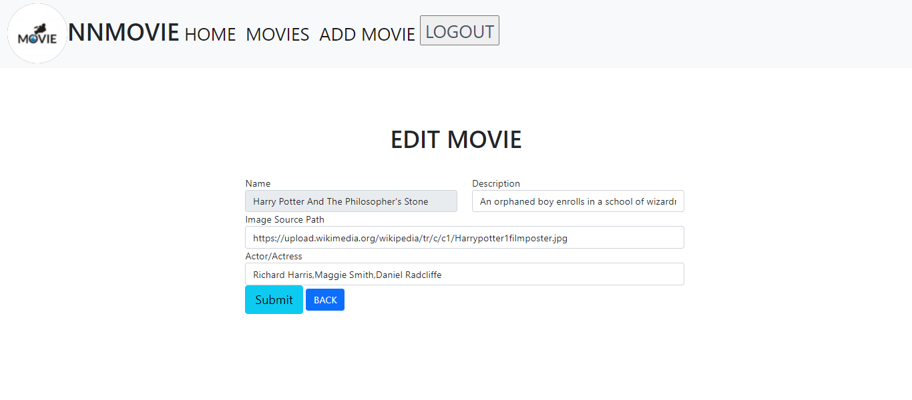
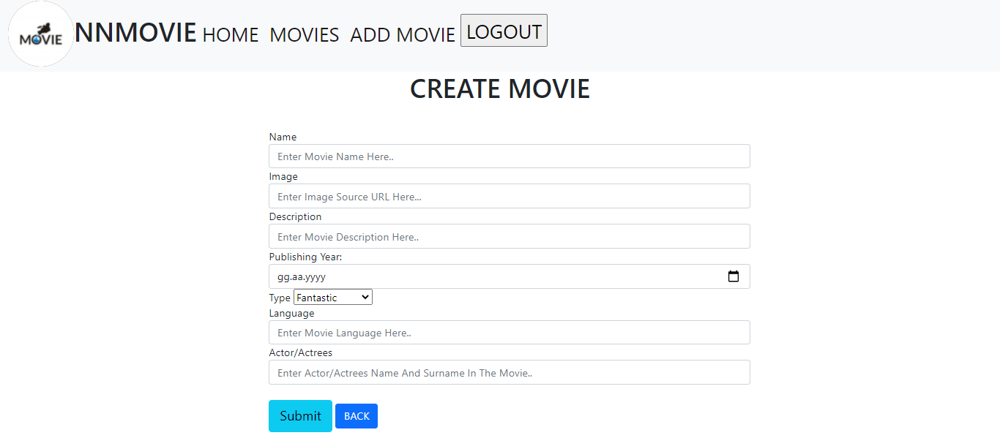

# NNMOVIE
  NNMOVIE is a movie archive collection. When you press the login button in the upper right corner, you can log in to our movie system and add movies to our system, delete movies from our system or update the movies in our system. So, do you have to log in? No!! When you press the movies button in the upper right corner, you can see all the movies saved in the system and have detailed information without logging into the system.
 
## MODULES
 User Module, Admin Module
  The user module will only be able to see the movies registered in the system and the details of these movies. The admin module, on the other hand, will be able to see the movies recorded in the system as well as delete and update these movies. He can add a new movie if he/she wants.

## TECHNOLOGY USED

 Spring boot for Autoconfiguration Spring MVC For Web application development HTML used for User Interface JPA,Thymeleaf, Hibernate, Bootstrap used Database Used MySQL
 
 ## ACTIONS
 
 * EDIT MOVIE
 * CREATE MOVIE
 * DELETE MOVIE
 * WIEW MOVIE INFO
 * SIGN IN 
 * SIGN UP 
 * SEARCH MOVIE BY NAME, TYPE, ACTOR/ACTRESS
 * SORT MOVIE BY YEAR

## IMAGES

 *HOMEPAGE

*USER MOVIE HOME

*USER MOVIE INFO

*LOGIN

*SIGN UP

*SUCCESSFULLY SIGN UP

*ADMIN MOVIE HOME

*ADMIN MOVIE INFO 

*EDIT MOVIE

*CREATE MOVIE

 
 ## EXPLANATION
 
 If there is an admin already registered in the system, that is, the user table is full and you want to log into the system with the information here, it will not see your password as bcrypt. Because of this, you will not be able to login to the system, an error will occur. If you run the part called EncodedPassword.java, it will give you your password as encrypted and bcrypt.

## MySQL Insert

After we have created your tables with MySQL, you can manually add users, administrators and movies, or you can add the information in the MySQL_insert file to your system with a query.

## PROJECT RUN COMMAND

*download zip forder

*unzip and open folder with netbeans/eclipse ide

*create a database name moviecollection in mySQL

*clean and build folder

*finaly run maven Goals
